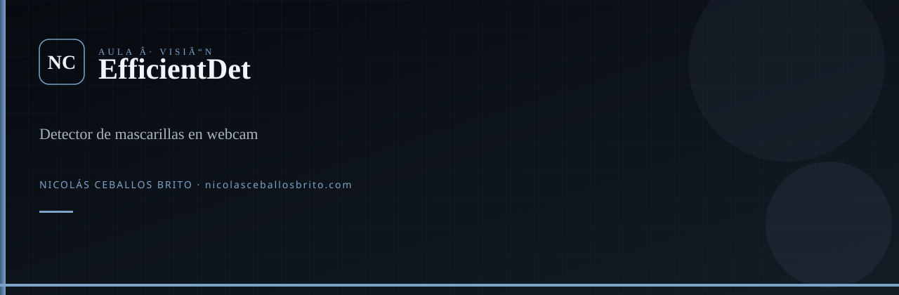

<div align="center">
  
</div>

<br />

<div align="center">

**Detector de mascarillas en webcam** con EfficientDet-D1 (TensorFlow 2). El SavedModel **no viaja en este repo**.

[](https://www.python.org/)
[](https://www.tensorflow.org/)
[](LICENSE)

</div>

## Qué es

Loop de OpenCV que dibuja cajas: `with_mask`, `without_mask`, `mask_worn_incorrectly`. El detector afinado viene de [coolmunzi/face_mask_detector](https://github.com/coolmunzi/face_mask_detector) y hay que clonarlo **dentro** de este proyecto.

## Arranque

```bash
git clone https://github.com/Nico2603/EfficientDet.git
cd EfficientDet
git clone https://github.com/coolmunzi/face_mask_detector.git
python -m venv .venv
.venv\Scripts\activate
pip install -r requirements.txt
python main.py
```

Entrada del modelo en código: **640** (no 512). En Windows usa `CAP_DSHOW` si la cámara no abre.

## Agentes

`.agents/skills/` — Superpowers, `nicolas-identity`, `find-skills`, `machine-learning`. `graphify update .`

---

<div align="center">

**Nicolás Ceballos Brito** · Ingeniero en Sistemas y Telecomunicaciones (UCP 2025)  
CTO · Prosavis · Pereira, Colombia

[nicolasceballosbrito.com](https://nicolasceballosbrito.com)
·
[GitHub](https://github.com/Nico2603)
·
[LinkedIn](https://www.linkedin.com/in/nicolas-ceballos-brito/)
·
[X](https://x.com/NicolasCBrito)
·
[Instagram](https://www.instagram.com/nico_ceballos26/)
·
[Hugging Face](https://huggingface.co/Flackoooo)
·
[Email](mailto:nicolasceballosbrito@gmail.com)

</div>
